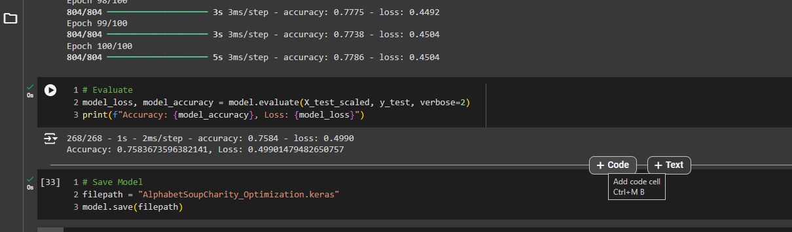

# Deep Learning Challenge

## Website: 
[website](https://github.com/Damiomo/deep-learning-challenge)

## Description
Create several deep learning models to predict successful businesses.

## Table of Contents
- [Installation](#installation)

- [Credits](#credits)
- [License](#license)
- [Features](#features)

- [Contact](#contact)

## Installation
Tensorflow, Pandas, StandarScaler Tran_test_split and python

## Credits
Damilare Omoboriowo

## License
MIT

## Features
It provides an optimized model with a 75% prediction rate.

## Contact
If there are any questions or concerns, I can be reached at:
##### [github: Damiomo](https://github.com/Damiomo)
##### [email: Domoboriowo14@Gmail.com](mailto:Domoboriowo14@Gmail.com)
